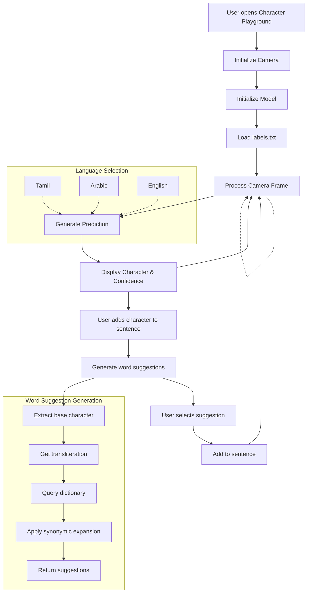

# Character Recognition Flow

## Implementation Details

1. **Camera Initialization**
   - Front camera is initialized for sign detection
   - Camera preview is displayed to the user
   - Processing occurs every 500ms to avoid performance issues

2. **Model Loading**
   - Labels are loaded from `assets/models/labels.txt`
   - PyTorch model `mobilenetv3_best.pth` is copied to app documents directory
   - Label map indices are created for efficient lookup

3. **Character Range Selection**
   - Tamil: Indices 0-247
   - English: Indices 248-274
   - Arabic: Indices 275-305

4. **Character Processing**
   - Camera frame is captured
   - Image is processed and sent to the model
   - Model returns predicted character and confidence
   - User can add character to sentence or select word suggestion

5. **Word Suggestion Algorithm**
   - Base character is extracted from prediction (removing transliteration)
   - Word dictionaries are queried for matching words
   - Synonymic query expansion adds related words
   - Final suggestions are displayed in a grid for selection 